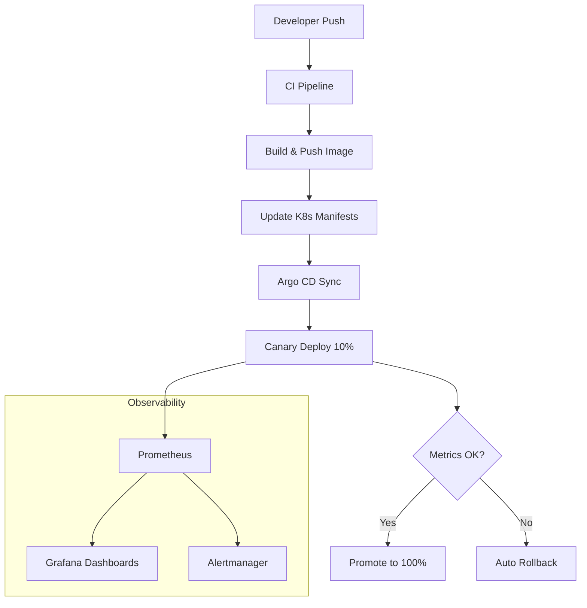

# Kubernetes Platform Engineering

[](https://github.com/Jai-Gogineni/kubernetes-platform-engineering/actions)
[](LICENSE)
[](https://www.terraform.io/)
[](https://kubernetes.io/)

Production cloud platform toolkit — GKE provisioning with Terraform, Istio service mesh, Prometheus/Grafana observability, canary deployments, and automated release pipelines.

## Architecture



## Components

| Directory | Purpose |
|-----------|---------|
| `infrastructure/terraform/` | GKE cluster provisioning (GCP) |
| `kubernetes/` | Base + overlay manifests (Kustomize) |
| `istio/` | Gateway, VirtualServices, canary routing |
| `monitoring/` | Prometheus rules, Grafana dashboards, alerts |
| `scripts/` | Deploy, canary promote, rollback utilities |
| `release/` | CI/CD pipeline templates |

## Quick Start

```bash
# Provision GKE cluster
cd infrastructure/terraform
terraform init && terraform apply -var="project_id=my-project"

# Deploy to dev
./scripts/deploy.sh dev

# Promote canary to stable
./scripts/canary-promote.sh
```

## Tech Stack

- **Cloud**: GCP (GKE), also applicable to AWS EKS / Azure AKS
- **IaC**: Terraform for cluster provisioning
- **Service Mesh**: Istio — traffic management, canary routing, mTLS
- **Observability**: Prometheus + Grafana + Alertmanager
- **Deployment**: Kustomize overlays + Argo CD GitOps
- **Scripting**: Bash for operational tooling

## Author

**Jai Gogineni** — [jaigogineni.com](https://jaigogineni.com)
